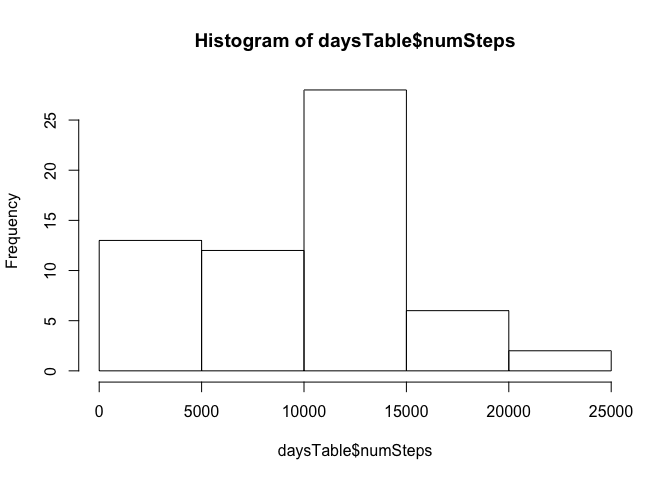
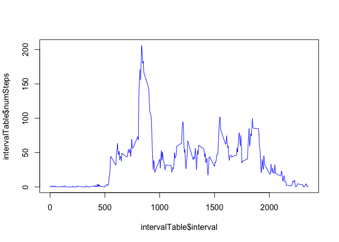
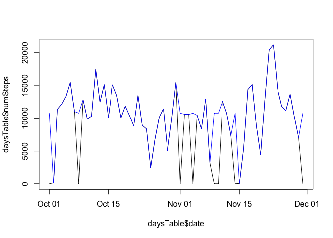
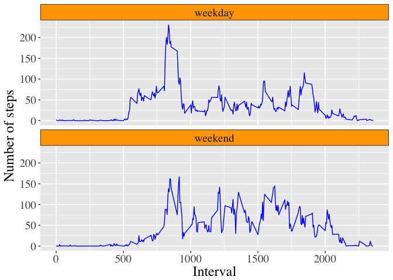

Report on the analysis performed on the "Activity Monitoring Data"

### Dataset Information

The variables included in this dataset are:

-   steps: Number of steps taking in a 5-minute interval (missing values
    are coded as NA)
-   date: The date on which the measurement was taken in YYYY-MM-DD
    format
-   interval: Identifier for the 5-minute interval in which measurement
    was taken

The dataset is stored in a comma-separated-value (CSV) file and there
are a total of 17,568 observations in this dataset.

### Loading and preprocessing the data

    # Loading packages and Data to be available throughout
    library(dplyr)
    library(ggplot2)
    # Loading and preprocessing the data
    dir.create("Figures")

    # Load the data
    df=read.csv("activity.csv",header = TRUE,stringsAsFactors = FALSE) 

    # Convert the date column as Date format
    df$date=as.Date(df$date)

### What is mean total number of steps taken per day?

    days <- group_by(df,date)
    daysTable <- summarise(days,numSteps = sum(steps, na.rm=TRUE))

##### Histogram of the total number of steps taken each day

    hist(daysTable$numSteps)

    dev.copy(png,file="./Figures/Fig1.png")

    ## quartz_off_screen 
    ##                 3

##### Mean total number of steps taken per day

    mean(daysTable$numSteps)

    ## [1] 9354.23

##### Median total number of steps taken per day

    median(daysTable$numSteps)

    ## [1] 10395

### What is the average daily activity pattern?

    timeInterval <- group_by(df,interval)
    intervalTable <- summarise(timeInterval,numSteps = mean(steps, na.rm=TRUE))
    plot(intervalTable$interval,intervalTable$numSteps,type = 'l',col="blue")

    dev.copy(png,file="./Figures/Fig2.png")

    ## quartz_off_screen 
    ##                 4

The interval "835", on average across all the days in the dataset,
contains the maximum number of steps

### Imputing missing values

##### Total number of missing values:

    sum(is.na(df$steps)) 

    ## [1] 2304

##### Merging data sets and imputing values by replacing NA with mean of that interval over all days

    dfNew <- merge(x=df,y=intervalTable,by.x = "interval",by.y = "interval")
    dfNew[is.na(dfNew)] <- dfNew[which(is.na(dfNew),arr.ind = TRUE)[,1],"numSteps"]
    dfNew$numSteps <- NULL

##### Histogram of the total number of steps taken each day

    daysNew <- group_by(dfNew,date)
    daysNewTable <- summarise(daysNew,numSteps = sum(steps, na.rm=TRUE))
    # Histogram of the total number of steps taken each day
    hist(daysNewTable$numSteps)

    dev.copy(png,file="./Figures/Fig3.png")

    ## quartz_off_screen 
    ##                 5

##### Mean total number of steps taken per day

    mean(daysNewTable$numSteps)

    ## [1] 10766.19

##### Median total number of steps taken per day

    median(daysNewTable$numSteps)

    ## [1] 10766.19

The mean and median are different from the case where NA was not
imputed.

##### What is the impact of imputing missing data on the estimates of the total daily number of steps?

    plot(x=daysTable$date,y=daysTable$numSteps,type="l")
    points(x=daysNewTable$date,y=daysNewTable$numSteps,type="l",col="blue")

    dev.copy(png,file="./Figures/Fig4.png")

    ## quartz_off_screen 
    ##                 6

The effect of imputing fills the spikes seen with missing data.

##### Are there differences in activity patterns between weekdays and weekends?

    # Function for finding the Weekday/Weekend
    weekendFinder <- function(x){
            weekday <- c("Monday","Tuesday","Wednesday","Thursday","Friday")
            weekend <- c("Saturday","Sunday")
            day <- weekdays(x)
            if(day %in% weekday){
                    return("weekday")
            } else {
                    return("weekend")
            }
    }

    dfNew['Week_day_end'] <- sapply(dfNew$date,weekendFinder)

    dfNew %>% group_by(Week_day_end,interval) %>% 
            summarise(average=mean(steps)) %>%
            ggplot(aes(x=interval,y=average)) +
            geom_line(col="blue")+
            facet_wrap(~Week_day_end,ncol=1)+
            labs(x="Interval")+
            labs(y="Number of steps")+
            theme(strip.background = element_rect(colour = "black", fill = "orange"),
                  strip.placement = "outside",
                  text = element_text(family = "Times",size = 18))+
            ggsave(filename="Fig4.png",
                   path="./Figures/")

There is indeed some difference in the steps taken especially between
intervals 750 and 1000.
